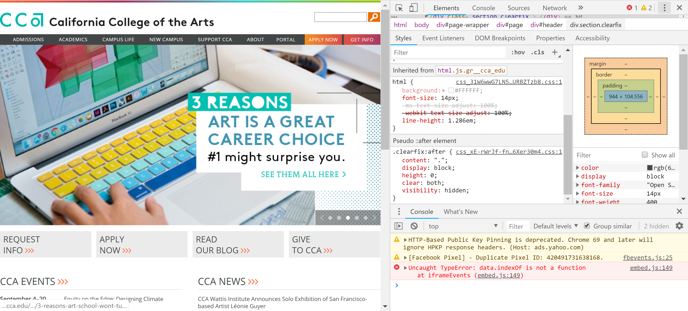

1.the number is called argument and it deyeermine the staus of the function
2.fill: color inside of the shape; stroke:outline color of the shape
3.after pull out the console, single right click, then press inspect.

4.for windows:Ctrl+Shift+J; for Mac: Command+Option+J
